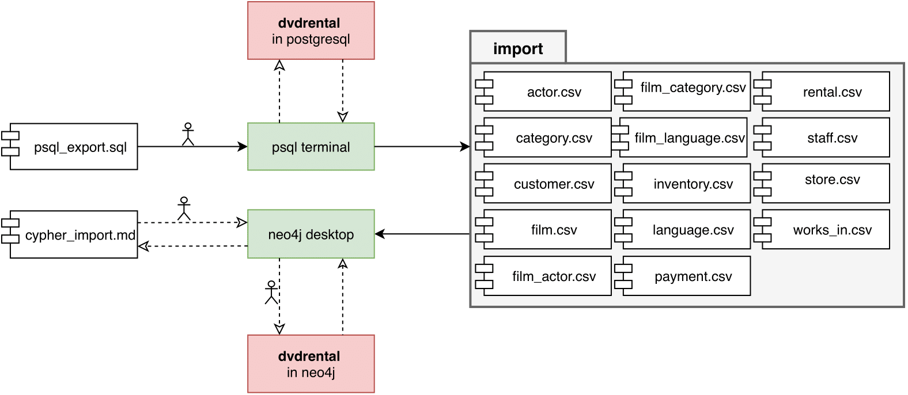

# Assignment 1. Report

#### Component Diagram

#### Data Transfer

Since I worked with Neo4j, I could use built-in Etl tool. But I chose not to, because I found the way it transforms entities representation to nodes-relationships representation inconvenient. I decided to do export and import using .csv table. So, the process is:

1. I use *\copy to* command in postgreSQL to copy selected columns to .csv file
2. I use cypher command *load csv with headers from file* in Neo4j Desktop to import data from .csv file

Since I chose this approach, I was not able to produce completely automated data export and import. Psycorg2 - library that is used to connect to psql database from python - was not accepting neither *\copy to* nor *copy to*. To import data, I used Neo4j Desktop application. The command I mentioned above requires .csv files to be placed in a special folder */home/usr/.config/Neo4j Desktop/Application/neo4jDatabases/<cur_database>/\<installation-version>/import*. Since I ran the whole database locally and this folder was on my laptop, writing script did not make sense, since it would not work on any other laptop. Nevertheless, I put them on .md file because it allows cypher code highlighting.

#### Decisions

File *psql_export.sql* contains all the queries I used to export data. Also, this file contains comprehensive comments.

Neo4j data representation can be seen from *diagrams/dvdrental.pdf*. It is not the exact same representation of data as it is in original *dvdrental*.

1. entities that have *address*, *city*, *country* separated (*customer, store, staff*) are transformed into nodes that have *address*, *city* and *country* as their property keys;
2. such entities as *film_actor*, that basically represents relationship (from perspective of ER diagram) between *film* and *actor*, are relationships in Neo4j. Same thing about *inventory* (*film* and *store*), *film_category* (*film* and *category*). Another example is *staff_id* that is stored in *store* table as foreign key. It is also considered to be a relationship between *staff* and *store* in Neo4j;
3. both *rental* and *payment* tables that involve more than 3 foreign keys are transferred in the following way:
   - *rental* is a node with key properties: *ID*, *rentalDate*, *returnDate* and *lastUPD*. Also, there are relationships CUSTOMER_RENTAL, FILM_RENTAL, STORE_RENTAL, STAFF_RENTAL. Each of these relationships is assigned *rental*‘s  *ID* to identify which *rental* each of the relationships belongs to. This is one of the ways to implement ternary and higher order relationships without losing consistency in a graph database, which allows only binary relationships. From the diagram, you can see a dashed arrow from relationship *HAS* to *rental*. *HAS* is analogue to *inventory* table. Notice that HAS has *ID*=*inventory_id*. It just shows the fact that original *rental* contains *inventory_id* which represents a pair (film_id, store_id). Since *inventory* became a relationship *HAS*, I connected *film* and *store* to *rental*.
   - *payment* is a node with key properties: ID, amount, paymentDate. In a similar way, I created relationships CUSTOMER_PAYMENT, RENTAL_PAYMENT, STAFF_PAYMENT, since original *rental* contained foreign keys *customer_id*, *rental_id* and *staff_id*.